# XYZ Retail — SQL Data Cleaning Project

A complete data cleaning pipeline built entirely in **SQL Server**, transforming a messy, real-world-style retail dataset into clean, analysis-ready tables.

## 📌 Overview

XYZ Retail is a synthetic retail company dataset (branches, employees, customers, products, orders, order_items) designed with intentionally dirty data — inconsistent formats, duplicates, invalid references, and bad values — to simulate real-world data quality challenges.

This project follows a full SQL-only data cleaning workflow:
**Create → Insert Dirty Data → Explore → Clean → Validate**

## 🎯 Objective

Identify and fix data quality issues using pure SQL (no external tools), preparing the dataset for reliable reporting and analysis.

## 🛠️ Tools

- SQL Server (T-SQL)
- SSMS

## 📂 Project Structure

```
├── DDL_creating_tables.sql       -- Table schemas with dirty data columns documented
├── inserting_uncleaned_data.sql  -- Intentionally dirty sample data
├── exploring_data.sql            -- Data profiling & issue detection
├── cleaning_data.sql             -- Cleaning & standardization logic
└── screenshots/                  -- Before/after results
```

## 🔍 Data Quality Issues Identified

| Issue Type | Examples |
|---|---|
| Inconsistent casing/formats | gender (`M`/`male`/`Female`), category (`electronics`/`Electronics`) |
| Invalid formats | phone numbers with symbols/spaces, mixed date formats |
| Invalid values | negative/zero salaries, negative stock, prices below cost |
| Duplicates | duplicate employees & customers (same email/phone) |
| Broken references | orphan `branch_id`, `customer_id`, `product_id` |
| Missing data | NULL names, emails, genders |
| Logical errors | delivery date before order date, discount > 100% |

## 🧹 Cleaning Approach

- **Standardization**: unified gender, category, boolean, and status values
- **Formatting**: normalized phone numbers, emails, and dates (`yyyy-MM-dd`)
- **Validation**: replaced invalid FKs with safe defaults, capped invalid discounts, fixed prices below cost
- **De-duplication**: detected and removed duplicate customer/employee records
- **Null handling**: applied sensible defaults (`N/A`, `Unknown`, average salary)

## 📊 Before → After

### Branches
| Before | After |
|---|---|
| 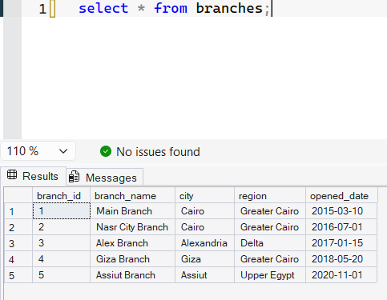 | 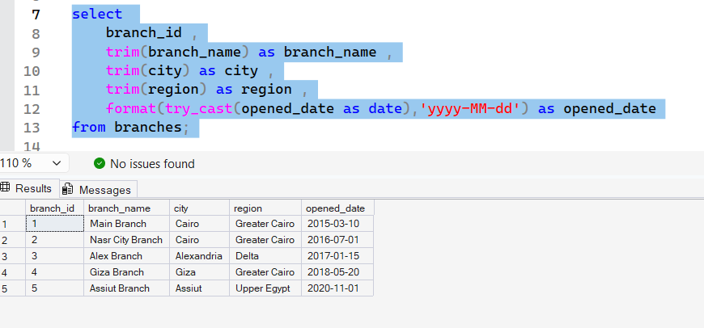 |

### Employees
| Before | After |
|---|---|
| 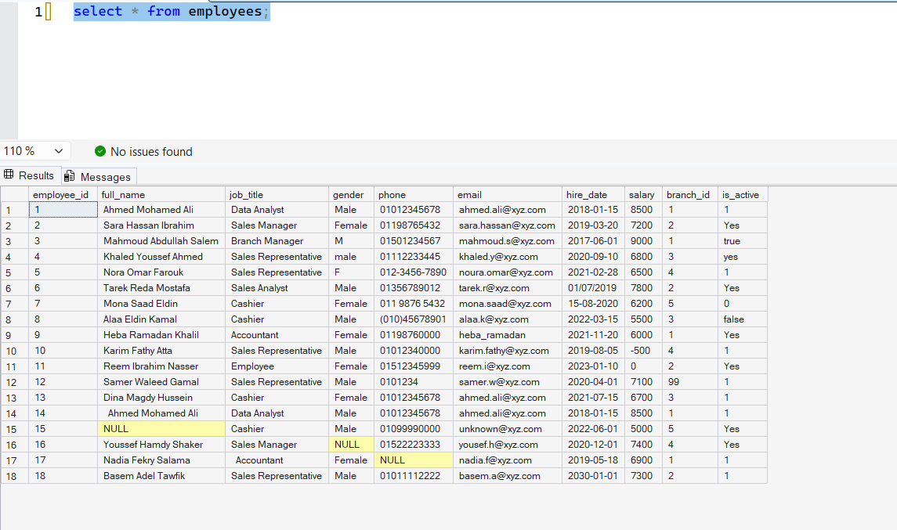 | 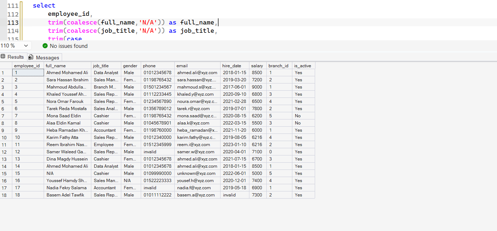 |

### Customers
| Before | After |
|---|---|
| 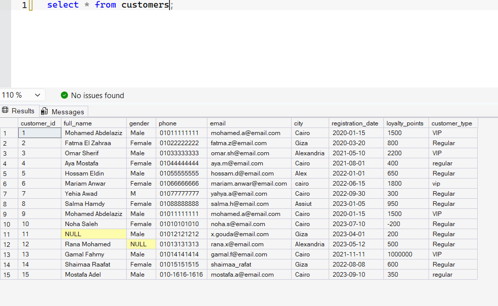 | 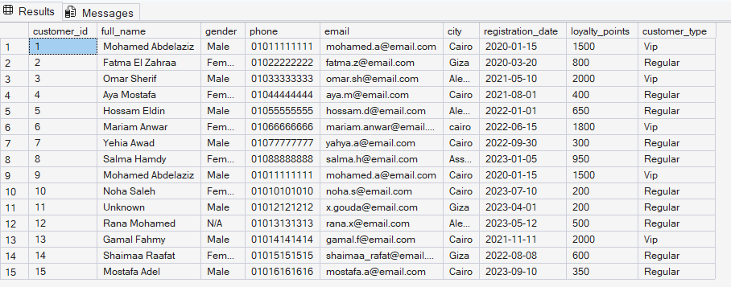 |

### Products
| Before | After |
|---|---|
| 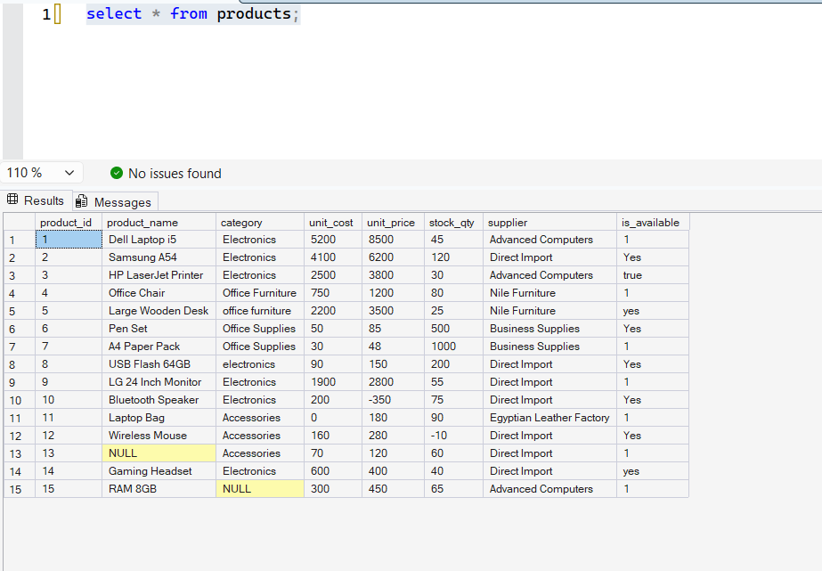 | 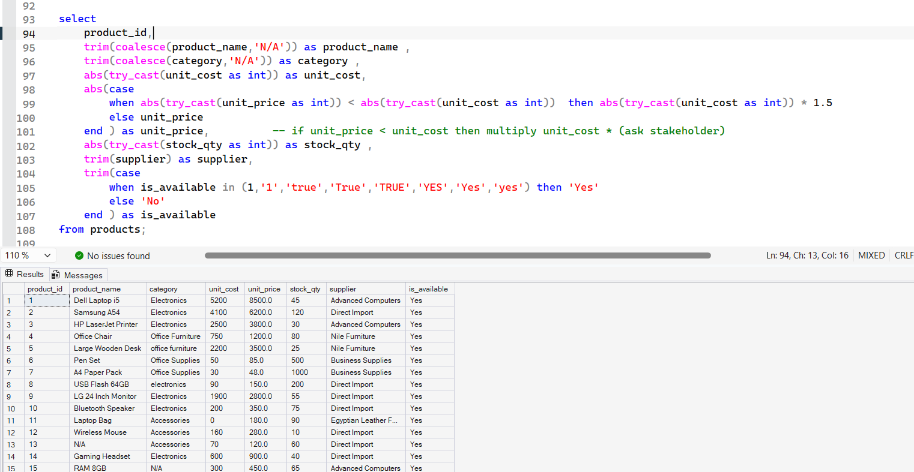 |

### Orders
| Before | After |
|---|---|
| 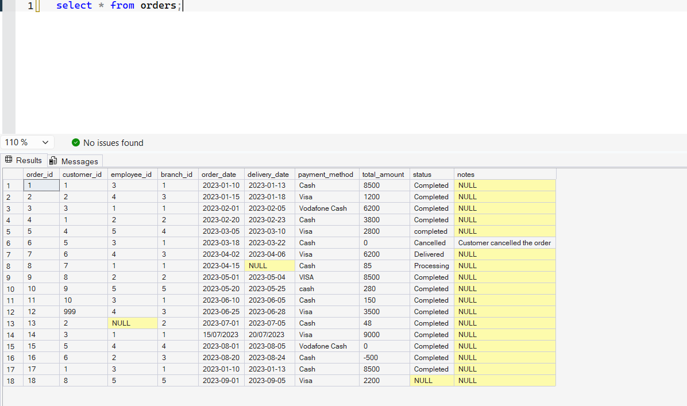 | 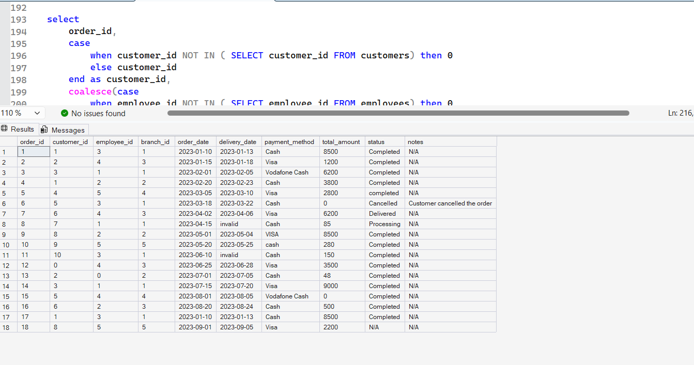 |

### Order Items
| Before | After |
|---|---|
| 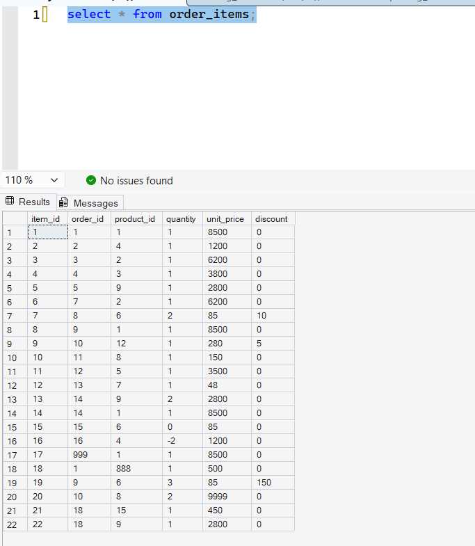 | 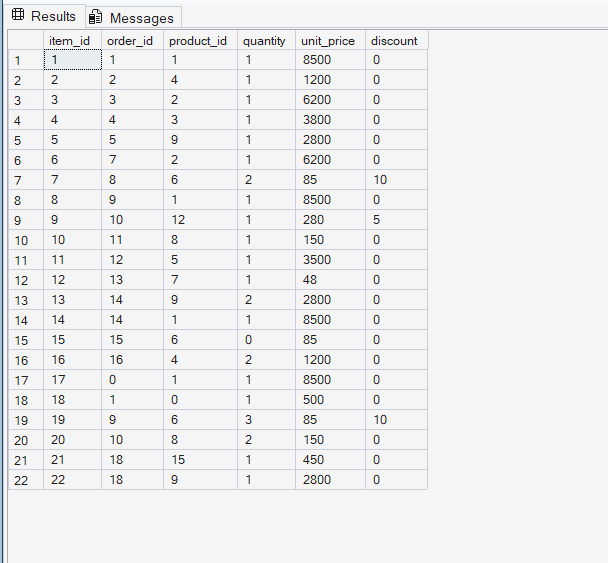 |

## 📈 Dataset Scale

| Table | Rows |
|---|---|
| Branches | 5 |
| Customers | 15 |
| Employees | 18 |
| Products | 15 |
| Orders | 18 |
| Order Items | 22 |

## 👤 Author

**Abdelrahman Bahaa** — Freelance Data Analyst & AI Automation Specialist
- [GitHub](https://github.com/abdelrahmanbahaa-lotfy)
- [LinkedIn](https://www.linkedin.com/in/abdelrahman-bahaa-lotfy-8ba35131b)
